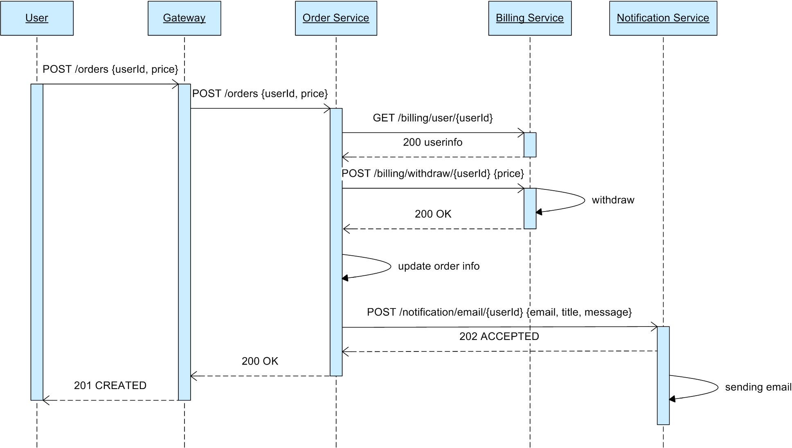
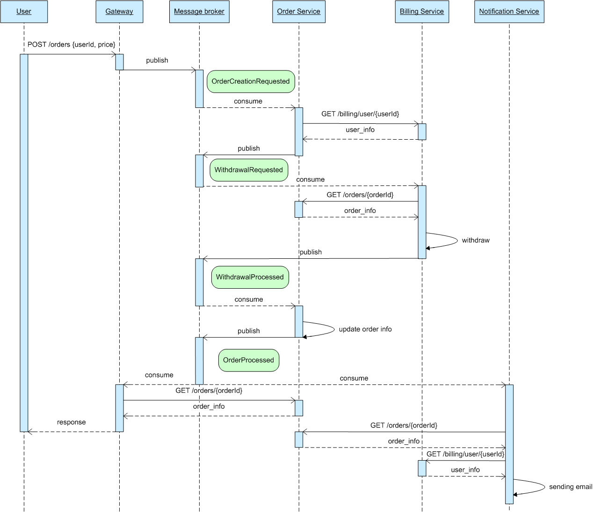
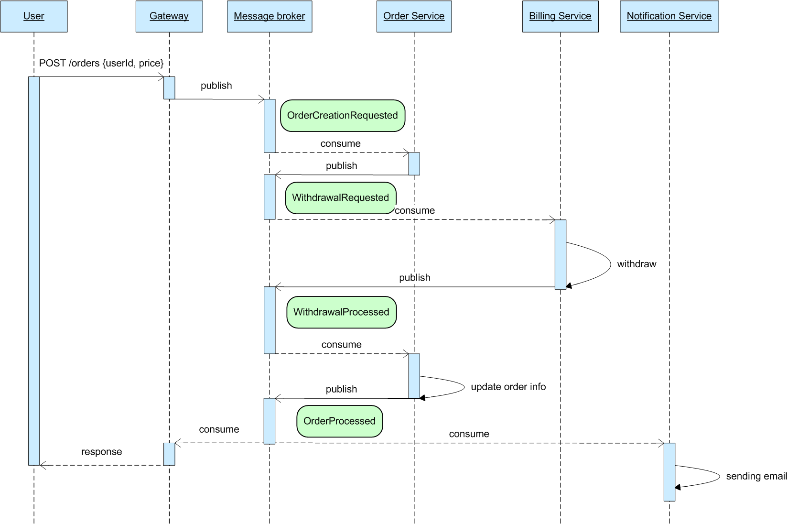

## Сценарий:

- Пользователь создает заказ с указанием цены. 
- С баланса пользователя снимается сумма, необходимая для оплаты заказа.
- Обновляется информация о заказе на основе результов списания средств.
- Через некоторое время пользователю приходит email об успешной или неуспешной оплате заказа. 

## RESTful

[Описание REST интерфейсов](http://petstore.swagger.io/?url=https%3A%2F%2Fraw.githubusercontent.com%2Fa-rodionov%2FOtus.SoftwareArchitect.HW_6%2Fmaster%2Frestful%2Frest-openapi.yaml)

Order Service фактически выполняет роль оркестратора сервисов. Из-за синхронной модели взаимодействия User Service "ждет" немного дольше, чем надо. Потенциально можно было бы отдать ответ, как только был получен результат списания средств с баланса пользователя, а действия связанные с отправкой email выполнять асинхронно. 

Но за счет синхронного взаимодействия схема получилась крайне простой и понятной. 

## Event Notifications

- [Описание ASYNC интерфейсов Gateway](./event-notifications/gateway-asyncapi.yaml)
- [Описание ASYNC интерфейсов Order Service](./event-notifications/order_service-asyncapi.yaml)
- [Описание ASYNC интерфейсов Billing Service](./event-notifications/billing_service-asyncapi.yaml)
- [Описание ASYNC интерфейсов Notification Service](./event-notifications/notification_service-asyncapi.yaml)

При добавлении событий в процесс взаимодейсвия сервисов можно перейти с оркестарции на хореографию. В payload событий добавлены только самые существенные данные - userId, orderId и т.д. Всю остальную информацию дргие сервисы вынуждены спрашивать у сервиса по RESTful протоколу.

Минус такой схемы конечно же большое количество GET запросов и повышенная нагрузка на чтение для других сервисов.

## Event Collaboration

- [Описание ASYNC интерфейсов Gateway](./event-collab/gateway-asyncapi.yaml)
- [Описание ASYNC интерфейсов Order Service](./event-collab/order_service-asyncapi.yaml)
- [Описание ASYNC интерфейсов Billing Service](./event-collab/billing_service-asyncapi.yaml)
- [Описание ASYNC интерфейсов Notification Service](./event-collab/notification_service-asyncapi.yaml)

Для исключение "лишних" чтений все необходимые данные передаются в payload сообщения. Это приводит к необходимости хранения в каждом сервисе "локальной" копии данных из других сервисов.

При этом схема взаимодействия становится немного проще.

Опять-таки проблемой становится поддержание в консистентном состоянии локальной копии данных. Например, при изменение профиля клиента Notification Service должен будет читать события UserUpdated и применять их у себя. Т.е. в случае возникновения новых событий нужно помнить про то, что эти события должны быть применены в других сервисах.

## Инструкция по утсановке и тестированию

1. kubectl create namespace hw

2. kubectl config set-context --current --namespace=hw

3. helm install billing ./billing\ service/billing-chart --atomic

4. helm install notification ./notification\ service/notification-chart --atomic

5. sed -i "s#BILLING_SERVICE_URL#http://billing-billing-chart.hw.svc.cluster.local:9000#" ./order\ service/order-chart/values.yaml

6. sed -i "s#NOTIFICATION_SERVICE_URL#http://notification-notification-chart.hw.svc.cluster.local:9000#" ./order\ service/order-chart/values.yaml

7. helm install order ./order\ service/order-chart --atomic

8. newman run ./tests/Otus.SoftwareArchitect.HW6.postman_collection.json
